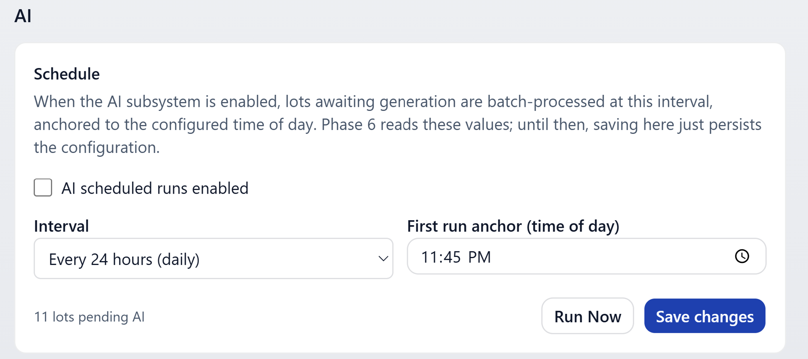
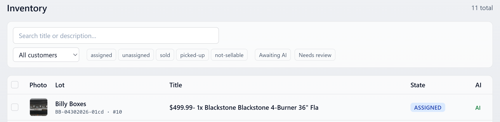
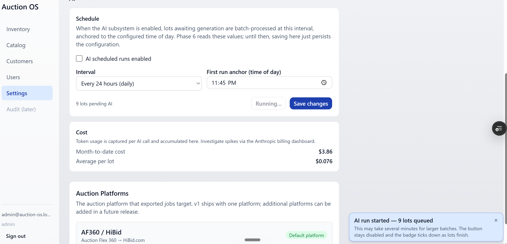
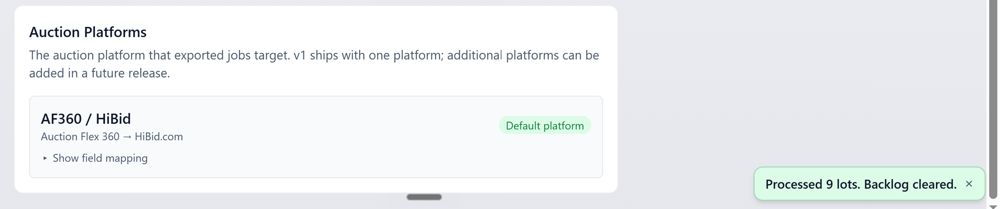
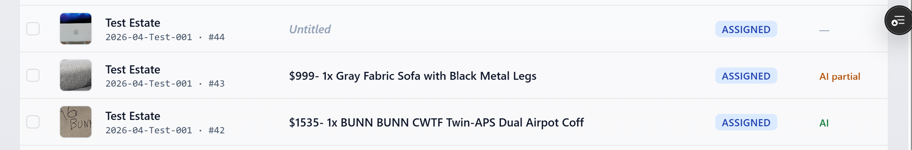

# AI generation

AI fills in **Title**, **Description**, and a reference **Price** for a
lot, using the photos plus whatever context you've already typed in.
Two ways to trigger it: manual **Run Now** on a lot, or the scheduled
cron from Settings → AI Schedule.

> **Phase 6 status:** in progress on `phase-6-ai-subsystem`. Behavior
> here reflects what's currently shipped on that branch.

## What AI fills (and what it doesn't)

It writes:

- **Title**
- **Description**
- **Price** (a reference suggestion you can override)

It leaves alone:

- **Quantity**, **Untested**, **Special Notes**, **Ref1**, **Ref2** —
  those are operator-controlled and never overwritten.
- **Photos** — AI reads them, but never deletes or rearranges.

If you've already filled Title, Description, or Price by hand, AI
won't overwrite your value.

## Manual: Run Now

Open the lot detail. The **Run Now** button sits near the AI status
area.

Clicking it kicks off a generation immediately. The button disables
while the run is in flight so you can't double-fire it.

## Status badges

The lot detail surfaces a badge that reflects the latest run.

The states:

- **Running** — call in flight; updates roughly every 5 seconds.

  

- **Success** — Title, Description, and Price all generated.

  

- **Partial** — some fields filled, others skipped or rejected (often
  because they were already set, or the model couldn't get a
  confident answer).

  

- **Failure** — the call errored. Hover or tap the badge for the
  message; common causes are network blips and quota limits.

## Live updates

The lot detail polls in the background while a run is in progress, so
the badge flips from **Running** to its final state without you having
to refresh.

## Editing AI output

Anything AI wrote, you can change. Just edit the field and save — your
edit takes precedence. A subsequent AI run won't clobber an edited
field.

## Scheduled runs

The cron picks up any lot that's **awaiting AI** (Title or Description
or Price still empty) and runs it on a fixed cadence. Configure the
cadence in [Settings](./settings.md#ai-schedule).

Manual runs from Run Now don't conflict with the schedule — they share
the same processing path.
