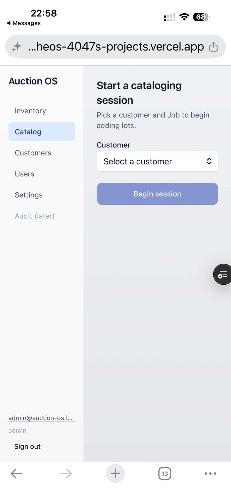
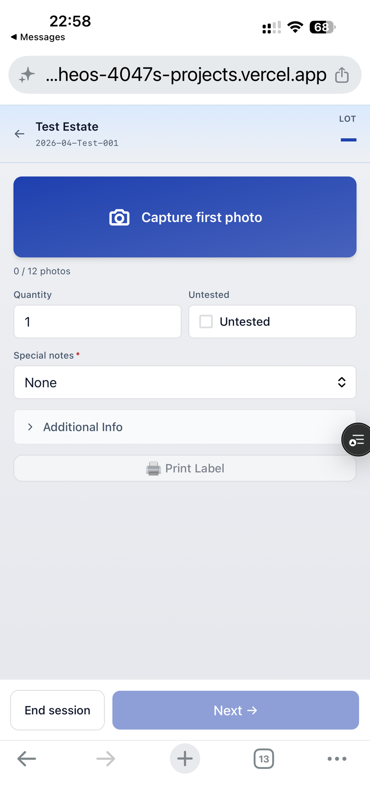
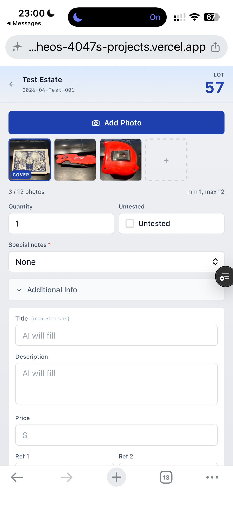
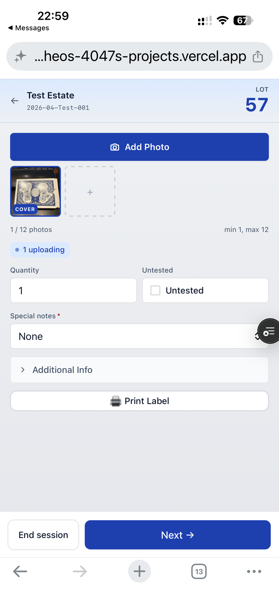
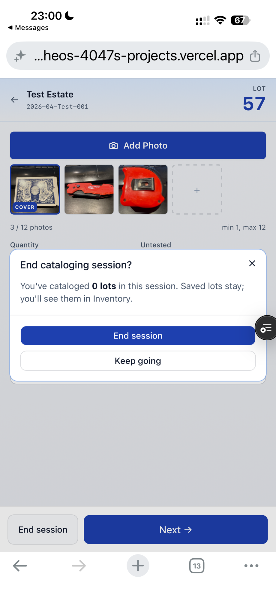

# Catalog session (mobile cataloging)

This is the mobile-first flow you use on the floor: pick a customer and
job, snap photos, fill in basic info, advance to the next lot. Designed
for one-handed use on a phone.

## Starting a session

Open **Catalog** from the sidebar. You'll be asked for a customer and a
job before anything else.

Pick the customer and job for the lots you're about to catalog. Both
are required — you can't start a session without a destination.

Once a session is active and there's no lot in progress yet, you'll see
this:

Hit **Start lot** to begin capturing.

## The session screen

A lot in progress looks like this from the top:

The header shows the customer and job you picked at the start, so you
always know where the lot is going. Below that is the photo strip,
followed by the always-visible fields and the **Additional Info**
collapse.

## Photos

Tap the camera button to add photos. They appear in the strip in the
order you added them.

Each photo uploads in the background. The thumbnail will look blank for
a second while the upload finishes — that's normal, give it a moment.
You can keep working while uploads are in flight.

To remove a photo, tap it and hit the delete affordance.

## Always-visible fields

Three things sit outside the collapse because they're either quick or
important:

- **Quantity** — how many units the lot covers.
- **Untested** — checkbox; flip it on if the item hasn't been verified
  to work.
- **Special Notes** — dropdown with `None`, `TOOL ONLY`, `READ`, and
  `CLOTHING`. If you pick `CLOTHING`, a size field appears.

## Additional Info

The rest lives in a collapse so the screen stays short on a phone.

Closed:

Open:

The fields are **Title**, **Description**, **Price**, **Ref1**, and
**Ref2**. None of these are required at catalog time — leave them blank
and AI will fill Title, Description, and Price for you on the next
scheduled run (or trigger one manually from the lot detail later).

## Advancing to the next lot

When you're done with the current lot, hit **Advance**. The lot saves,
the session stays open, and a fresh lot starts under the same
customer/job.

## Discarding a lot

If you started a lot you didn't mean to, hit **Discard**.

Discard wipes the in-progress lot — photos and fields go away, and
nothing gets saved. The session itself stays active so you can start a
new lot.

## Pull-to-refresh and tab close

The current lot ID lives in the URL, so a pull-to-refresh on iOS Safari
brings you right back to the same lot you were editing. Same goes for
closing the tab and reopening it.

Field edits are autosaved continuously — to your phone first (almost
instant) and to the server right after — so even an abrupt close loses
at most the last fraction of a second of typing.

## Coming back to an in-progress lot

If you walked away mid-lot, just open Catalog again. The session and the
lot you were on will be there. No need to re-pick the customer or job.
