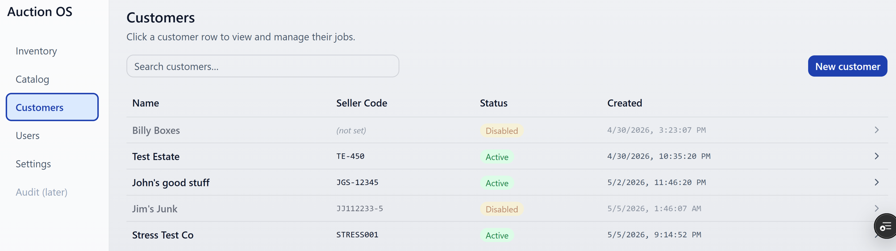
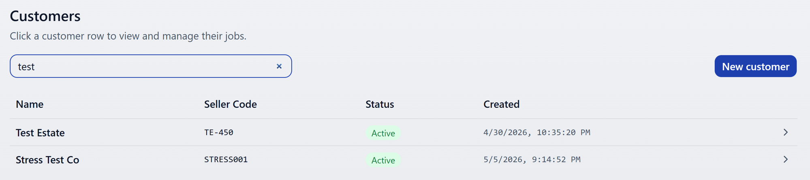
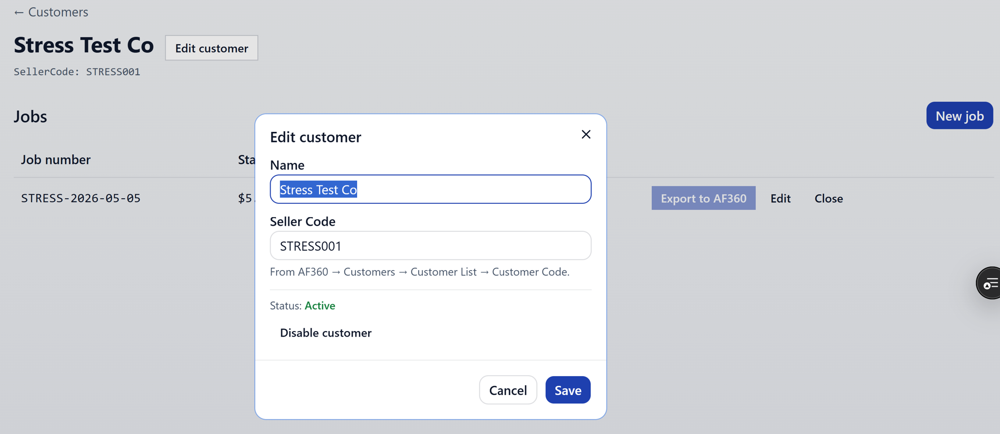
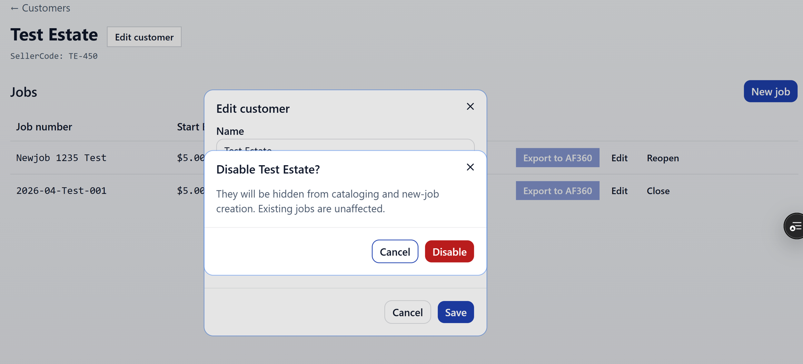
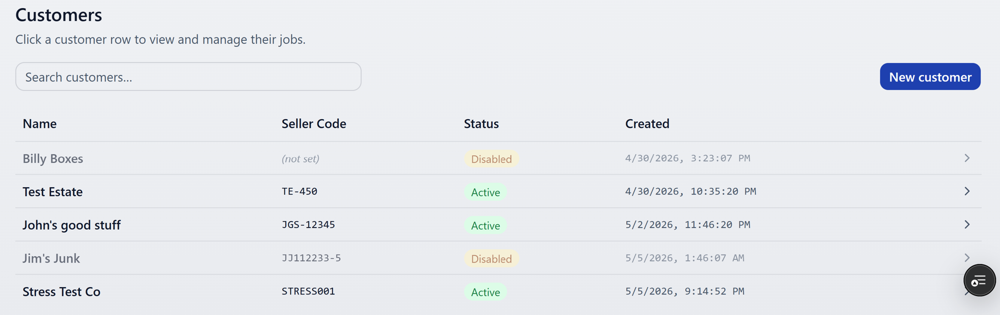
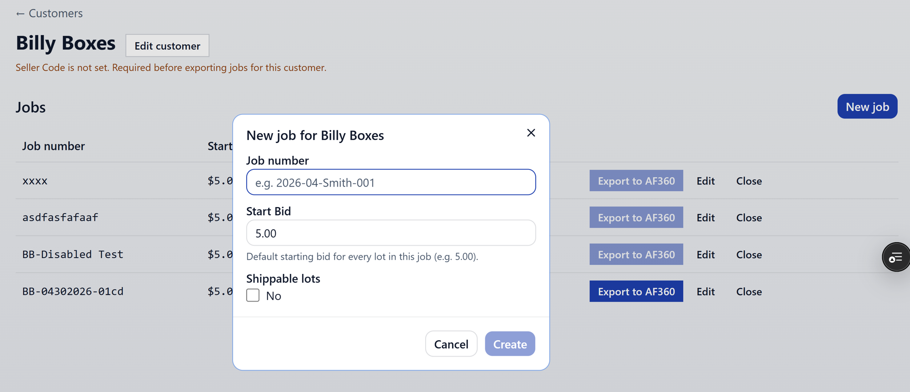
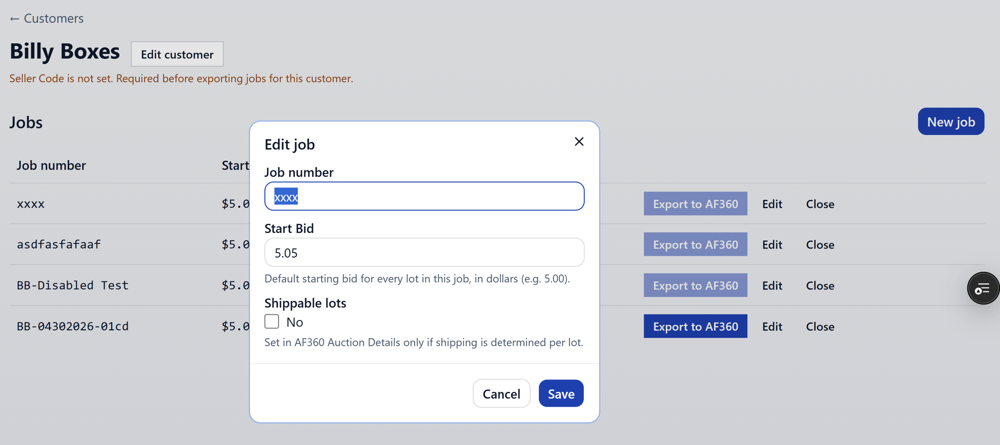
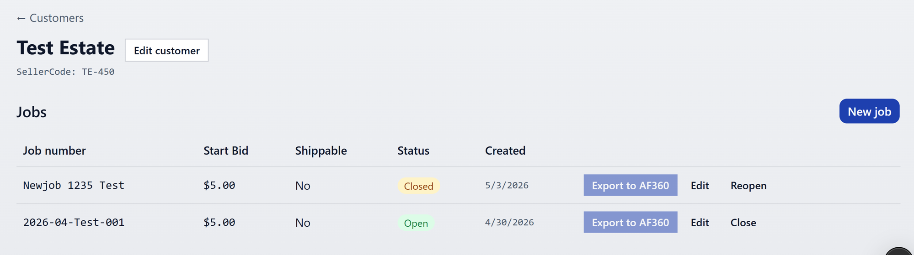

# Customers and jobs

Customers (sellers) and the jobs (auctions) that hold their lots.
Available to Admin and Office. Warehouse picks customer/job at the start
of a catalog session but doesn't see this page.

## Customers list

Search by name; the list narrows as you type.

Click a row anywhere to open the customer detail page.

## Customer detail

The customer page shows the customer's jobs and an **Edit Customer**
button in the header.

### Editing a customer

Two fields:

- **Name**
- **Seller Code** — required for AF360 / HiBid export. Without it,
  exports for any of this customer's jobs will fail with
  `SELLER_CODE_REQUIRED`.

### Disabling a customer

Use **Disable** when a seller is no longer active.

A disabled customer:

- Doesn't appear in the catalog session picker.
- Can't have new jobs created against them.
- Their existing jobs and lots stay visible and editable — disable is
  a soft state, not a delete.

The page shows a clear disabled banner so you don't forget:

To bring them back, hit **Re-enable** from the same place.

## Jobs

Jobs live under a customer. Each job is one auction.

### Creating a job

From the customer page, hit **New job**.

Fields:

- **Job Number** — your reference for the auction
- **Start Bid** — default starting bid for lots in the job
- **Shippable** — checkbox; affects how the auction platform handles
  the listing

### Editing a job

Same fields as create. Edits don't disturb existing lots — they apply
going forward and to anything you re-export.

## Exporting a job

Each job row has an **Export** button.

That's the entry point for the AF360 / HiBid pipeline. See
[Export to AF360](./export-to-af360.md) for what happens next.
