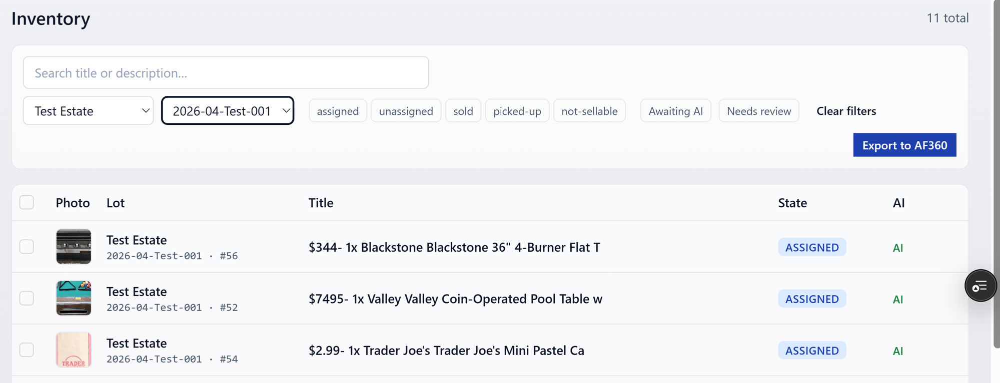
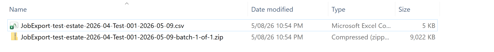

# Export to AF360 / HiBid

Turns a job's lots into a CSV plus image zip(s) ready to upload to
AF360 / HiBid. Available to Admin and Office.

## Before you export

- The customer must have a **seller code** set on their profile. No
  seller code, no export.
- The job must have at least one lot in an exportable state.

If either is missing, the export will refuse to start with a clear
error.

## Two ways to start

**Per-job button** — on the customer page, each job row has an
**Export** button.

**Inventory-level button** — when you filter Inventory by a single
job, the same button appears in the filter row.

Both go through the exact same pipeline.

## What happens after you click

The button walks through these steps in place:

1. **Preparing export** — server pulls the lot data and writes the CSV.
2. **Building batch N of M** — images are bundled into one or more zips.
   Large jobs produce multiple zips so each download stays manageable.
3. **Downloading batch N of M** — you'll see download links appear as
   each batch finishes.

## Success

When everything finishes, the panel shows the CSV and every zip with a
direct download link.

Save them locally, then upload to AF360 / HiBid in their usual flow.
The CSV maps to AF360's 7-column lot-import spec; you don't need to
massage it before uploading.

## Failures

A few errors you might see:

- **`NO_LOTS`** — the job has no exportable lots. Check the state
  filter in inventory; lots in `not-sellable` or already exported
  states won't be included.
- **`SELLER_CODE_REQUIRED`** — the customer is missing a seller code.
  Open the customer page, edit, and add it.
- **Batch error** — a single batch can fail mid-zip on a transient
  blob-storage hiccup. A **Retry** button appears next to the failed
  batch; the rest of the download links still work.

If retrying doesn't clear it, contact an admin to check the Vercel Blob
store config.

## Cleanup

The CSV and zips are stored in temporary blob storage and auto-deleted
after 24 hours. Download what you need before then. If you need to
re-export later, just hit Export again — it'll regenerate fresh files.
