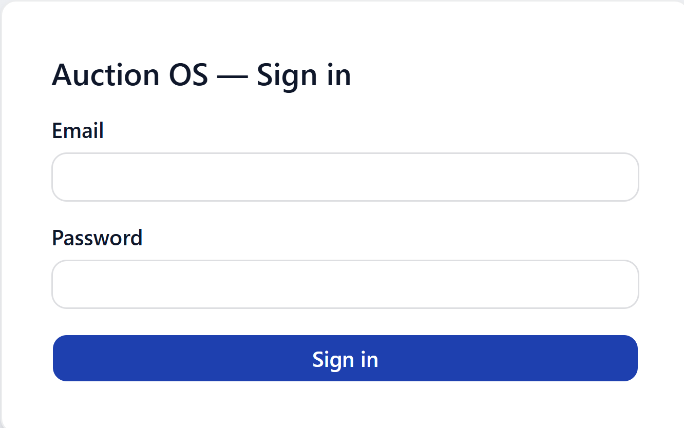
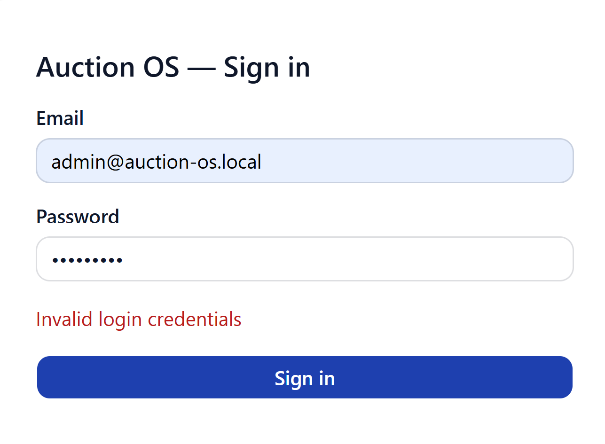
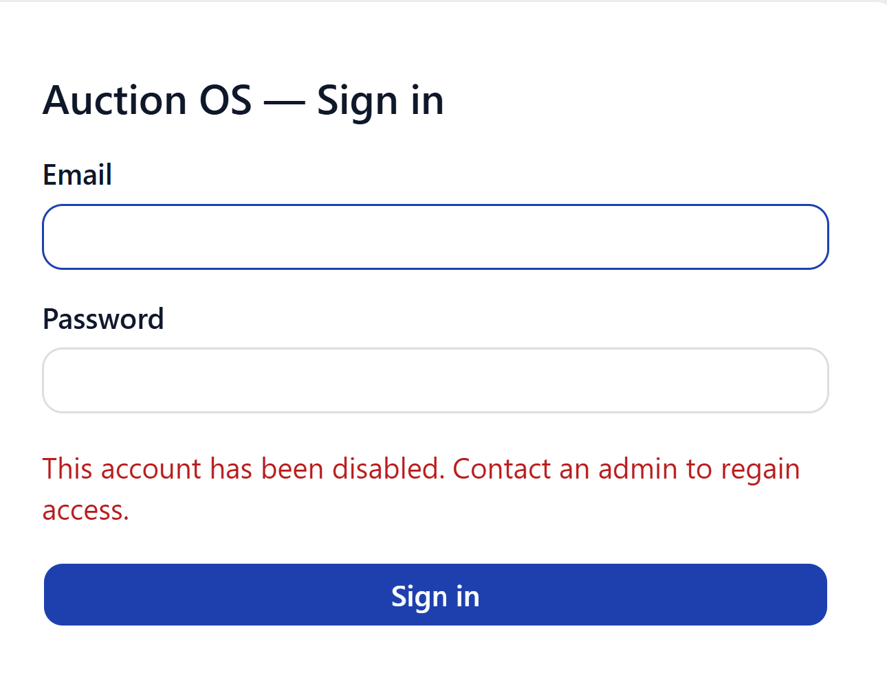
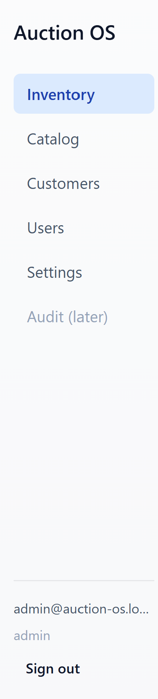
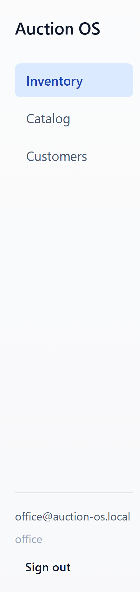
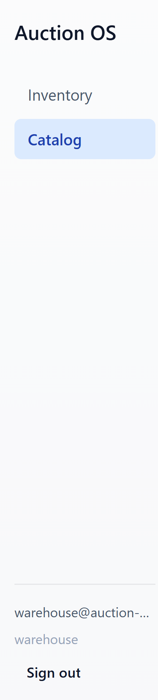

# Getting started

Sign in, find your way around, sign out. That's the whole page.

## Signing in

Go to the app URL your admin sent you. You'll land on the sign-in
screen.

Enter your email and password and hit **Sign in**. That's it — there's
no "forgot password" link in v1, so if you're locked out, ask an admin
to reset you.

### Wrong password

If your credentials don't match, you'll see this:

Double-check the email (most issues are typos) and try again.

### Disabled account

If your account has been disabled by an admin, the sign-in form will
look like this after you submit:

You can't get past this on your own — contact an admin to re-enable the
account.

## Where you land after sign-in

The app sends you to a different page depending on your role:

| Role      | Lands on    |
|-----------|-------------|
| Admin     | `/inventory` |
| Office    | `/inventory` |
| Warehouse | `/catalog`   |

If you opened a deep link before signing in (say, someone shared a
specific lot URL), the app honors that instead and takes you there once
you're authenticated.

## The sidebar

The left sidebar is your main navigation. What you see depends on your
role.

### Admin

Admins see everything: **Inventory**, **Catalog**, **Customers**,
**Users**, **Settings**, plus **Audit (later)** which is greyed out —
that's a v2 feature, not broken.

### Office

Office sees **Inventory**, **Catalog**, and **Customers**. No Users or
Settings — those are admin-only.

### Warehouse

Warehouse sees **Inventory** and **Catalog** only. Catalog is the
primary screen for the intake workflow on a phone or tablet.

## Signing out

The bottom of the sidebar shows your email and role, with a **Sign
out** button below. Hit it and you're back on the sign-in screen with a
clean state — toasts and stale data don't leak across to whoever signs
in next.

If you're switching users on the same machine, always sign out first
rather than just navigating to `/login`.
