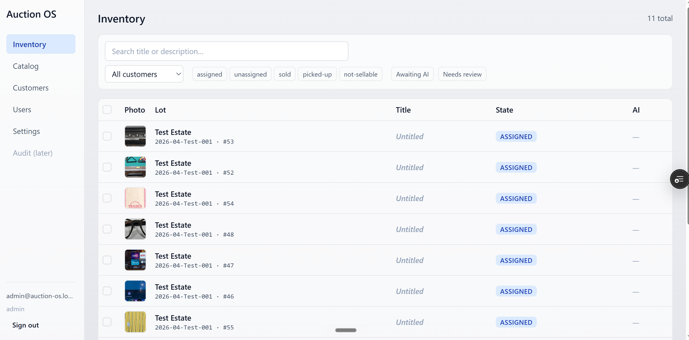
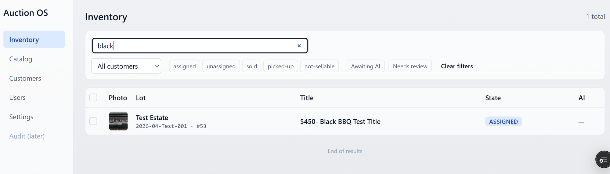
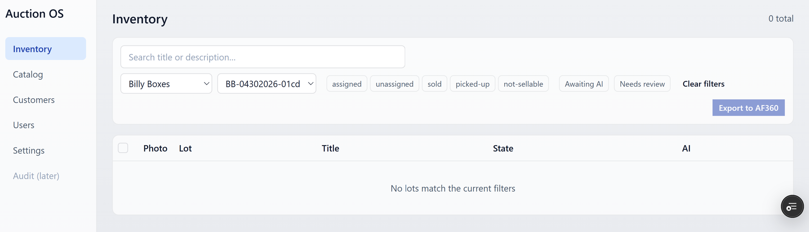
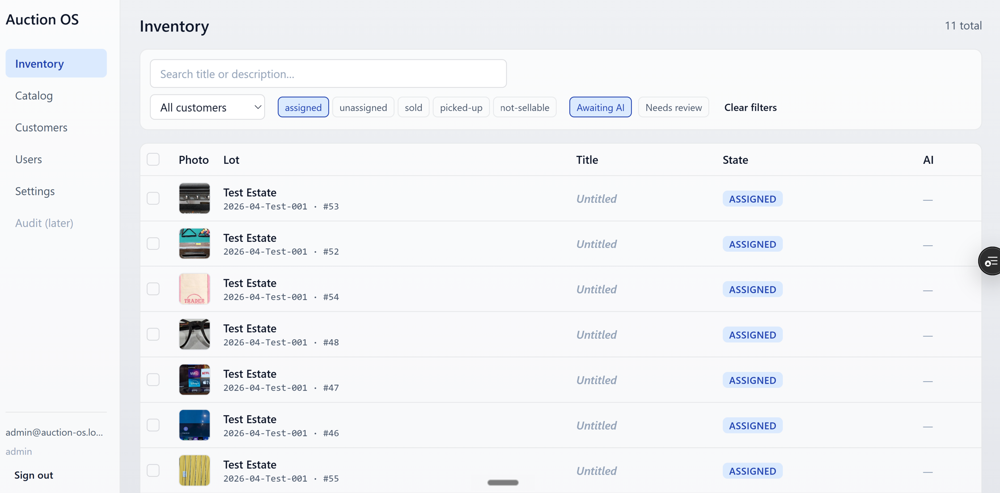
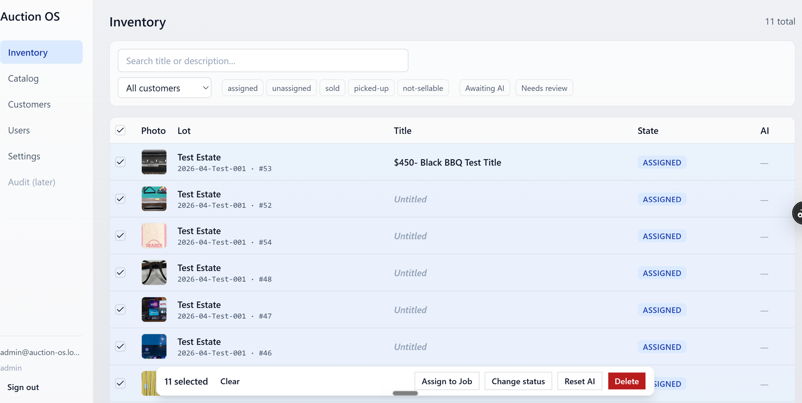
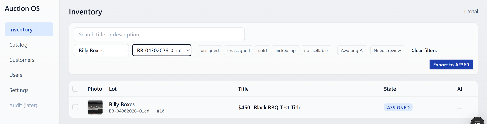

# Inventory

The desktop-first list of every lot in the system. Search, filter, bulk
actions, and the entry point for opening a lot's detail.

## The list

Each row shows a thumbnail, the lot reference (customer + job + lot
number), title, state, and AI status. Click a row anywhere to open the
lot detail.

The list is infinite-scroll — there are no page numbers. Scroll down
and more lots load.

## Search

The search box lives in the filter panel and matches against **title or
description**. It's debounced — type, pause for a moment, results
update.

If nothing matches your search or filter combination, you'll see the
empty state:

## Filters

Open the filter panel (left rail on desktop, sheet on mobile) to narrow
the list.

Available filters:

- **Customer** — single customer
- **Job** — single job (combine with Customer to drill in)
- **State** — checkboxes for `assigned`, `unassigned`, `sold`,
  `picked-up`, `not-sellable`
- **Awaiting AI** — lots that haven't been processed yet
- **Needs Review** — lots flagged after an AI run
- **Reprint Pending** — lots with a label reprint queued

Filters stack — applying multiple narrows the list further.

## Bulk actions

Admin and Office only. Tick the checkbox on rows to select them; an
action bar appears below the table.

The bar offers:

- **Change state** — push the selected lots to a new state
- **Move** — assign the selected lots to a different job
- **Reset AI** — clear AI output so the next run regenerates
- **Delete** — admin only

Warehouse users don't see checkboxes or the bulk bar at all.

## Export to AF360

When the **Job** filter is active, an Export button appears in the
filter row.

It's the same export pipeline as the per-job button on the customer
page — see [Export to AF360](./export-to-af360.md) for what happens
next.

## Opening a lot

Click any row to open the lot detail in a modal. The list stays in the
background so closing the modal returns you exactly where you were.
