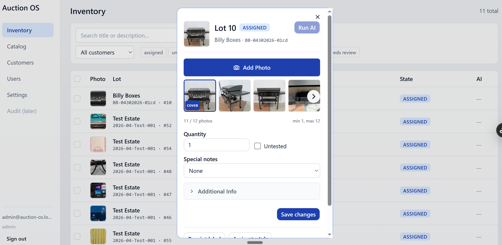
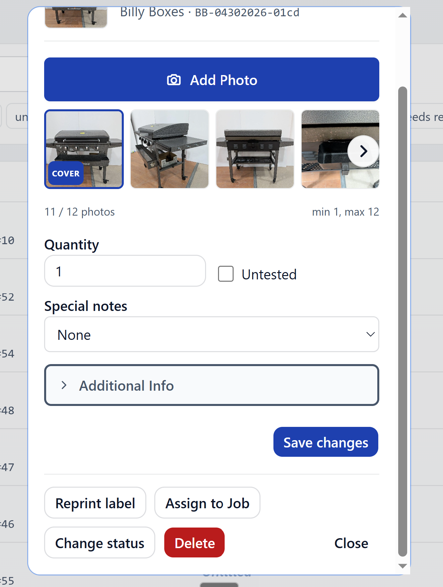
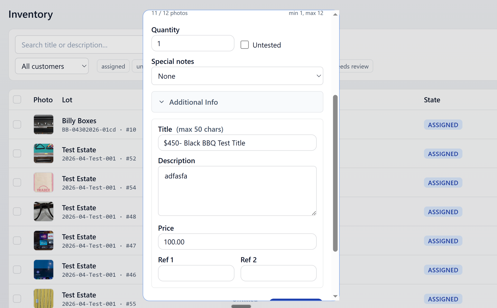
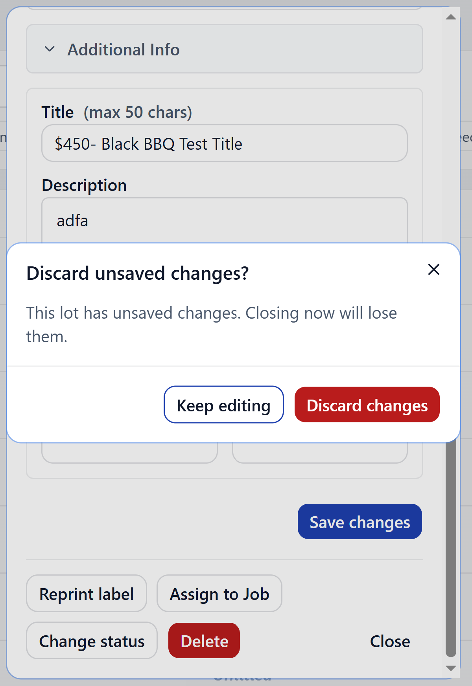
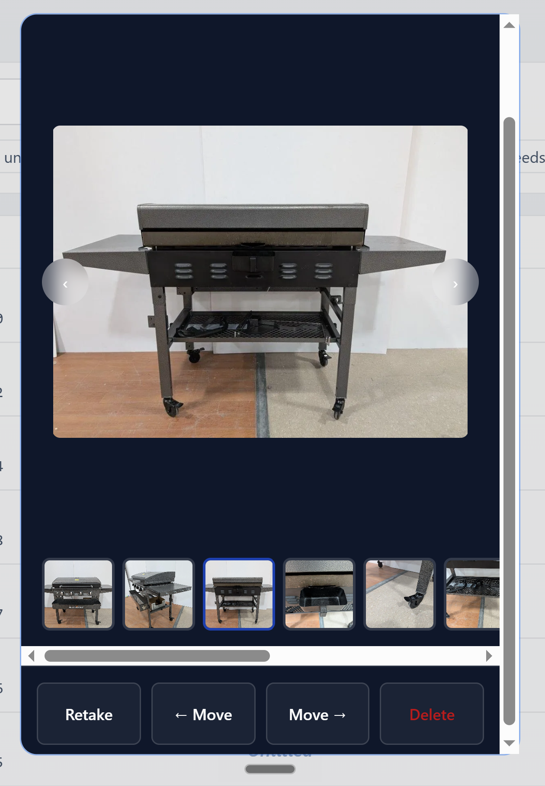
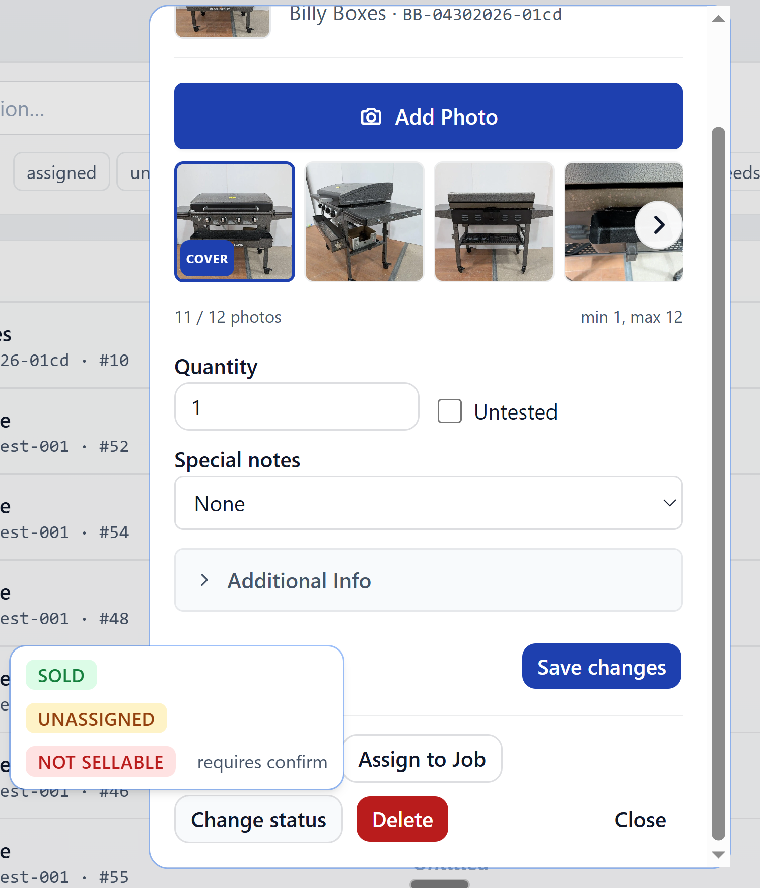
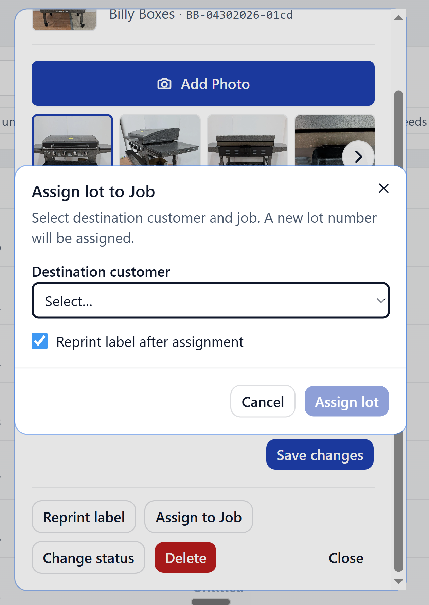
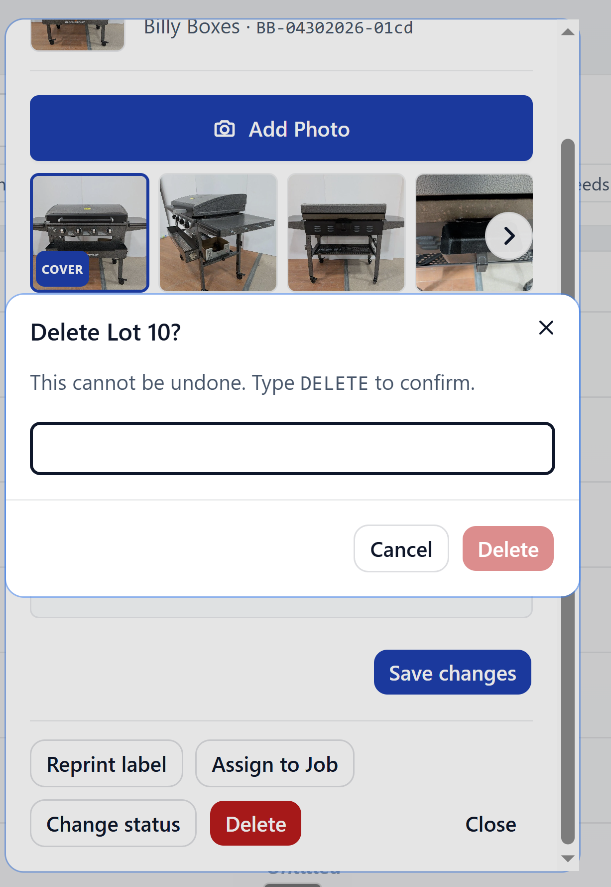
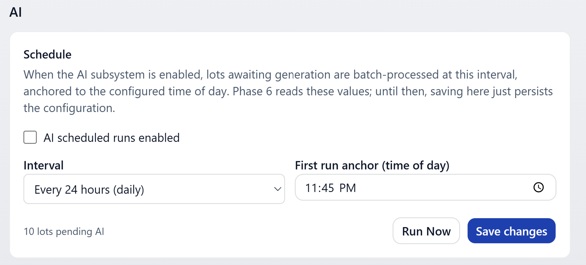

# Lot detail

The modal that opens when you click a lot — from inventory, from a
customer's job page, or anywhere else a lot is linked. Edit fields,
manage photos, change state, move to a different job, run AI, or delete.

## Fields

Always visible:

- **Quantity** — how many units in the lot
- **Untested** — checkbox
- **Special Notes** — `None` / `TOOL ONLY` / `READ` / `CLOTHING`
  (Clothing reveals a Size field)

Inside the **Additional Info** collapse:

- **Title**, **Description**, **Price**, **Ref1**, **Ref2**

Open the collapse to see and edit those:

Hit **Save Changes** to commit. If you try to close the modal with
unsaved edits, you'll get a warning:

Pick **Discard** to lose them, or **Cancel** to go back and save.

## Photos

The photo manager lets you add new photos and delete existing ones.

Photos uploaded here go through the same background queue as catalog
photos — thumbnails appear once the upload finishes.

## Changing state

Admin and Office only. Open the state menu and pick a destination
state.

The available transitions depend on where the lot currently is. You
can't push a lot from `unassigned` directly to `sold`, for example —
it has to be assigned to a job first (use Move for that).

## Move / Assign to Job

Reassign a lot to a different job — or assign it for the first time
if it's `unassigned`.

Pick the destination job and confirm. Moving an unassigned lot also
flips its state to `assigned` automatically.

## Delete

Admin only. The button is hidden for everyone else.

Deletion is permanent — there's no undo from the UI. If a lot has
already been exported to AF360, talk to ops before deleting.

## AI status

The lot detail surfaces the AI run status as a badge.

- **Running** — a generation is in flight
- **Success** — Title, Description, and Price all generated
- **Partial** — some fields generated, others skipped or rejected
- **Failure** — the run errored; hover/tap for details

## Run AI now

Available to all roles when AI hasn't already filled the lot's fields.

Hit it to kick off a generation immediately. The button disables while
the run is in progress, and the badge updates roughly every 5 seconds
until the run completes — no need to refresh.

See [AI generation](./ai-generation.md) for the full picture.
