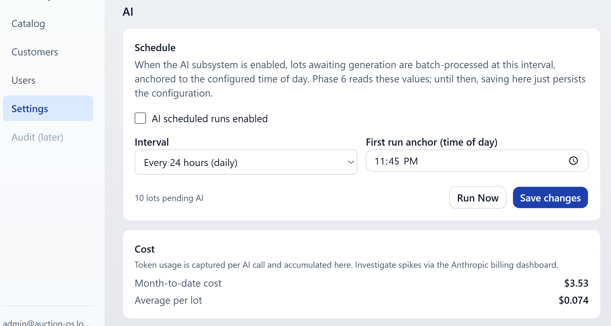
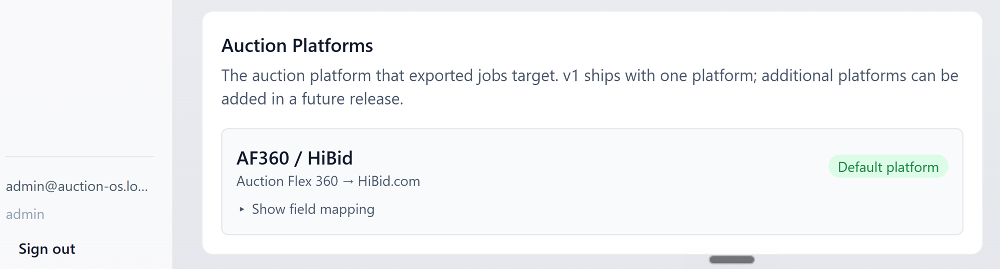
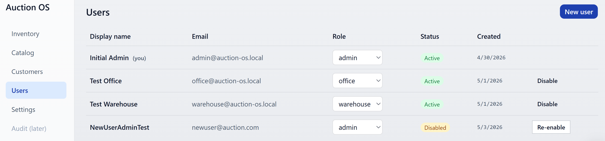
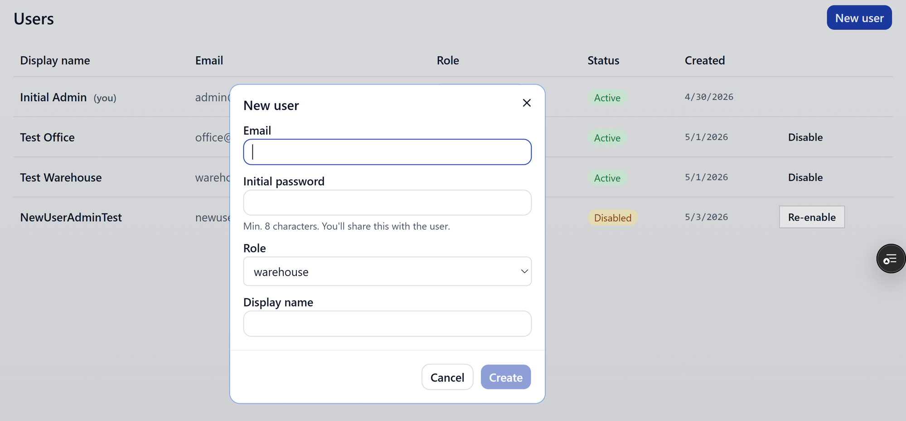
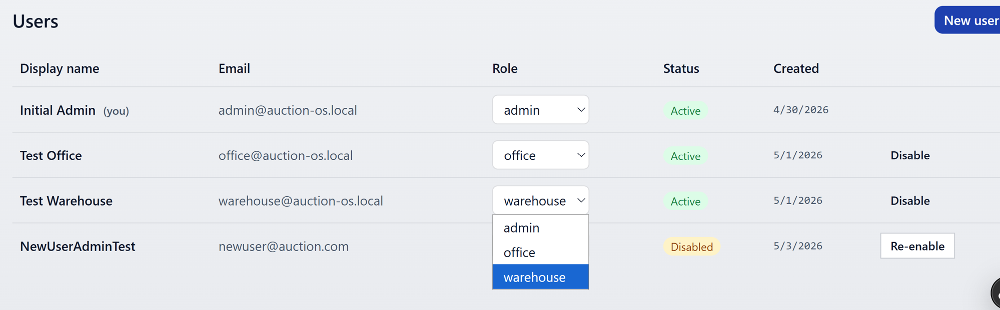
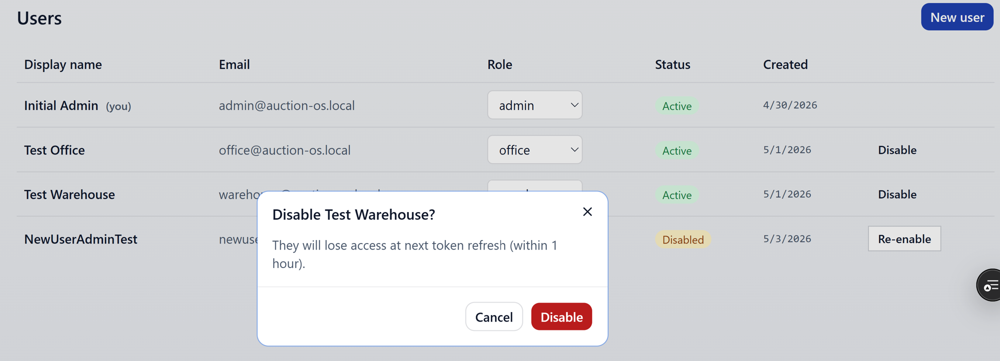

# Settings

Admin only. Three panels: **AI Schedule**, **Auction Platforms**
(read-only), and **Users**.

## AI Schedule

Controls the scheduled AI generation cron.

- **On / off toggle** — flip off if you want to pause scheduled runs
  entirely. Manual Run Now from a lot still works either way.
- **Frequency** — pick the interval in hours: `4`, `8`, `12`, or `24`.
  Each tick processes any lot that's awaiting AI.
- **Time of day** — anchor for the daily / multi-hour cadence.

Hit **Save** to commit. You can save these values even before the AI
subsystem is fully active — they'll take effect once it is.

See [AI generation](./ai-generation.md) for what each scheduled run
actually does.

## Auction Platforms

Read-only summary of the configured export platform (currently AF360 /
HiBid). Changing the platform is code-only in v1 — talk to a developer
if a different platform needs to be wired up.

## Users

The list shows display name, email, role, status (Active / Disabled),
and created date.

### Adding a user

Hit **Add user**.

Fields:

- **Email**
- **Password** — set the initial password here
- **Role** — Admin / Office / Warehouse
- **Display name**

After you create the user, a one-time toast displays the password so
you can copy and share it with the new user. The toast hangs around for
about 30 seconds — copy it before it clears, because the password isn't
recoverable from anywhere else in the UI.

### Changing a role

Click the role on a user's row to open the inline picker.

Confirm the change in the prompt that appears.

### Disabling a user

Disabled users can't sign in. They'll see the disabled-account message
on the login screen instead. To re-enable, hit the same control —
it'll be labelled **Re-enable** when the user is in the disabled state.

### Last-admin protection

You can't disable or demote the only remaining active admin. The system
blocks the change with a clear error so you don't accidentally lock the
whole organization out.

### No hard delete

There's no "delete user" button in v1. Disable is the way to remove
someone's access — it preserves their history (who created which lot,
who exported what) intact.
